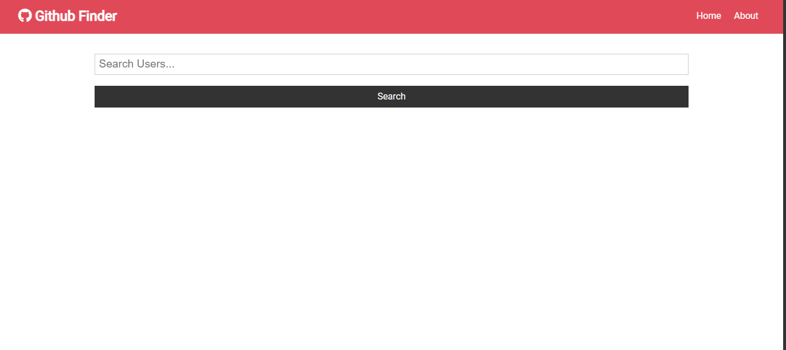
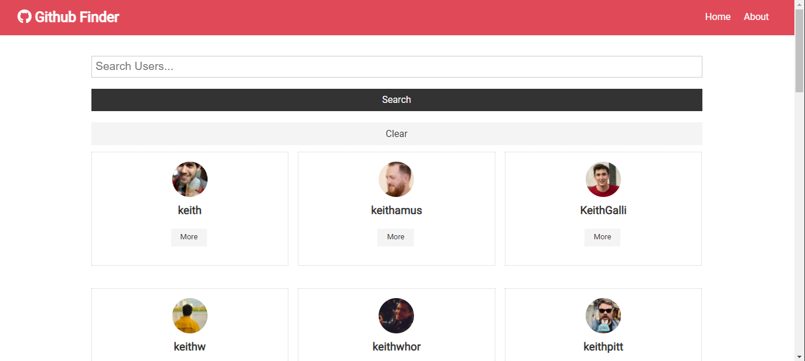
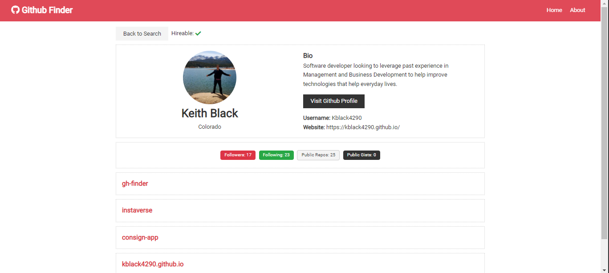

# GitHub Finder

## Table of Contents

- [Description](#Description)
- [Usage](#Usage)
- [Technologies](#Technologies)
- [Deployed Application](#Deployed-Application)
- [License](#License)

## Description

GitHub Finder is an application where users can search GitHub user profiles and see there most recent projects

## Usage

At the home page the user will be presented with a search bar. There they can enter a name. Once the names are submitted then GitHub users with that name will populate. The user can select the more button on the Github user cards and will be brought to the Github user page with more information about that individuals profile.

To go back to the home page the user can select home in the navigation bar. If the user no longer wants to view the Github users they search then they can simply select clear to clear the populated Github users.

## Technologies

- [JavaScript](https://developer.mozilla.org/en-US/docs/Web/JavaScript)
- [Node.js](https://nodejs.org/en/)
- [React](https://reactjs.org/)
- [axios](https://www.npmjs.com/package/axios)
- [dotenv package](https://www.npmjs.com/package/dotenv)

## Deployed Application

- [Github Finder](https://githubfinder4290.netlify.app/)

## Screenshots of Application

### Homepage:

### Github User List:

### Github User Page:

## License

Copyright &copy; 2021 Keith Black

Permission is hereby granted, free of charge, to any person obtaining a copy
of this software and associated documentation files (the "Software"), to deal
in the Software without restriction, including without limitation the rights
to use, copy, modify, merge, publish, distribute, sublicense, and/or sell
copies of the Software, and to permit persons to whom the Software is
furnished to do so, subject to the following conditions:

The above copyright notice and this permission notice shall be included in all
copies or substantial portions of the Software.

THE SOFTWARE IS PROVIDED "AS IS", WITHOUT WARRANTY OF ANY KIND, EXPRESS OR
IMPLIED, INCLUDING BUT NOT LIMITED TO THE WARRANTIES OF MERCHANTABILITY,
FITNESS FOR A PARTICULAR PURPOSE AND NONINFRINGEMENT. IN NO EVENT SHALL THE
AUTHORS OR COPYRIGHT HOLDERS BE LIABLE FOR ANY CLAIM, DAMAGES OR OTHER
LIABILITY, WHETHER IN AN ACTION OF CONTRACT, TORT OR OTHERWISE, ARISING FROM,
OUT OF OR IN CONNECTION WITH THE SOFTWARE OR THE USE OR OTHER DEALINGS IN THE
SOFTWARE.
